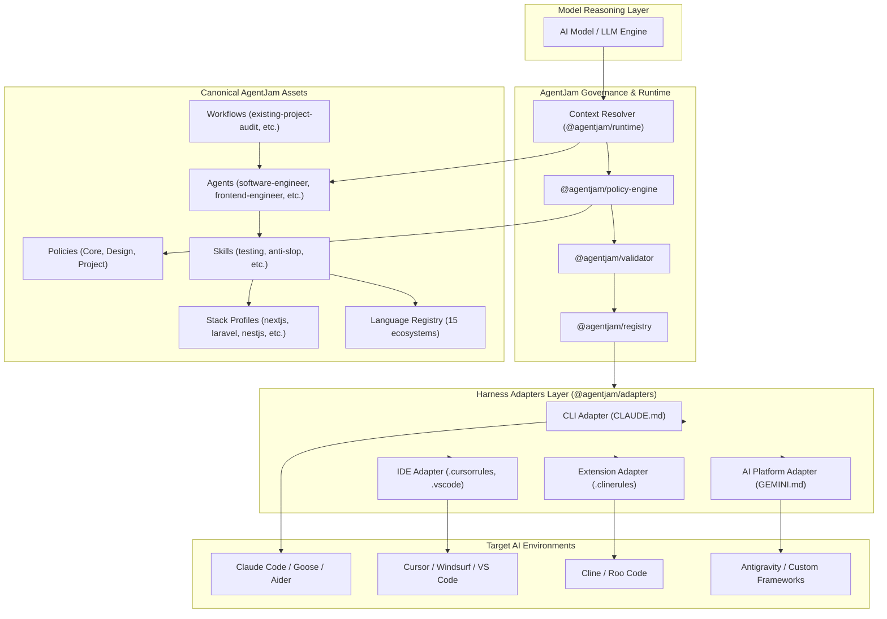

```text
    ___                    __    ______
   /   | ____  ___  ____  / /_  / ____/____ _____ ___
  / /| |/ __ \/ _ \/ __ \/ __/ /___ \ / __ `/ __ `__ \
 / ___ / /_/ /  __/ / / / /_  ____/ / /_/ / / / / / /
/_/  |_\__, /\___/_/ /_/\__/ /_____/\__,_/_/ /_/ /_/
      /____/
```

# AgentJam

[](file:///c:/wamp64/www/fullstack/package.json)
[](file:///c:/wamp64/www/fullstack/LICENSE)
[](file:///c:/wamp64/www/fullstack/scripts/validate.ts)
[](file:///c:/wamp64/www/fullstack/package.json)
[](file:///c:/wamp64/www/fullstack/docs/concepts/architecture.md)
[](https://github.com/primasdevlabs/agentjam/stargazers)
[](https://github.com/primasdevlabs/agentjam/network/members)
[](https://github.com/primasdevlabs/agentjam/graphs/contributors)
[](https://github.com/primasdevlabs/agentjam/issues)
[](https://github.com/primasdevlabs/agentjam/pulls)

AgentJam is an open-source, harness-agnostic runtime and governance system for AI coding agents.

It establishes a strict separation between model reasoning and project execution:

> **The model provides reasoning. AgentJam provides the rules, tools, current conventions, freshness requirements, language definitions, and constraints.**

AgentJam prevents AI agents from introducing unvetted dependencies, inventing non-existent APIs, using outdated training memory, or generating visual slop.

---

## Repository Stats, Badges & Tags

### Community Metrics

| Metric                  | Value                   | Reference                                                                  |
| :---------------------- | :---------------------- | :------------------------------------------------------------------------- |
| **Release Version**     | `v1.0.0`                | [package.json](file:///c:/wamp64/www/fullstack/package.json)               |
| **Repository License**  | MIT License             | [LICENSE](file:///c:/wamp64/www/fullstack/LICENSE)                         |
| **Build & Test Status** | 100% Passing            | [scripts/validate.ts](file:///c:/wamp64/www/fullstack/scripts/validate.ts) |
| **Node.js Engine**      | `>=20.0.0`              | Monorepo Workspace standard                                                |
| **Architecture**        | Harness-Agnostic        | Canonical Neutral Format                                                   |
| **Active Stacks**       | 8 Pre-configured Stacks | [stacks/](file:///c:/wamp64/www/fullstack/stacks)                          |
| **Language Ecosystems** | 15 Ecosystem Categories | [languages/](file:///c:/wamp64/www/fullstack/languages)                    |
| **Design Governance**   | 12 Anti-Slop Policies   | [policies/design/](file:///c:/wamp64/www/fullstack/policies/design)        |

### Ecosystem Topic Tags

`#ai-agents` `#agent-governance` `#harness-agnostic` `#mcp` `#model-context-protocol` `#mcp-server` `#mcp-tools` `#claude-code` `#cursor` `#windsurf` `#roo-code` `#cline` `#antigravity` `#design-governance` `#anti-slop` `#language-registry` `#stack-profiles` `#monorepo` `#typescript`

---

## Featured Tech Stacks & Ecosystem Matrix

AgentJam provides canonical, enforceable governance rules and stack profiles for major software development stacks across web, backend, mobile, systems, and data ecosystems.

### 1. Web & Frontend Framework Stacks

- **Next.js Stack (`stacks/nextjs`)**
  - Language: TypeScript 5+ (Strict Mode)
  - Framework: Next.js 14/15 (App Router, Server Components, Server Actions, Route Handlers)
  - Styling: CSS Modules, Vanilla CSS, Tailwind CSS v4
  - Tooling & Testing: Biome / ESLint, Vitest, Playwright, pnpm / npm
- **React SPA Stack (`stacks/react`)**
  - Language: TypeScript 5+
  - Bundler & Runtime: Vite, React 19
  - State & Styling: Zustand, Custom CSS Variables / CSS Modules
  - Tooling & Testing: Vitest, Testing Library, Biome
- **Vue 3 Stack (`stacks/vue`)**
  - Language: TypeScript 5+
  - Framework & State: Vue 3 (Composition API, `<script setup>`), Pinia, Vue Router
  - Bundler & Styling: Vite, Scoped CSS, Tailwind CSS
  - Tooling & Testing: Vitest, ESLint, Prettier

### 2. Backend & API Stacks

- **Laravel Stack (`stacks/laravel`)**
  - Language: PHP 8.3 / 8.4
  - Framework: Laravel 11/12 (Modular Monolithic Architecture, Form Requests, Inertia.js / Blade)
  - Database & ORM: PostgreSQL / MySQL, Eloquent ORM
  - Code Quality & Testing: Laravel Pint, PHP-CS-Fixer, Pest PHP, PHPUnit
- **NestJS Stack (`stacks/nestjs`)**
  - Language: TypeScript 5+
  - Framework: NestJS 10/11 (Modular Clean Architecture, Controllers, DTOs, Class Validator)
  - Database & ORM: Prisma ORM / TypeORM, PostgreSQL / Redis
  - Tooling & Testing: Jest, Vitest, ESLint, Prettier
- **Django Stack (`stacks/django`)**
  - Language: Python 3.11+
  - Framework: Django 5+, Django REST Framework (DRF)
  - Database & ORM: PostgreSQL, Django ORM
  - Tooling & Package Management: uv, Ruff, Pytest, Black
- **Ruby on Rails Stack (`stacks/rails`)**
  - Language: Ruby 3.3+
  - Framework: Rails 7/8 (ActiveRecord, ActionPack, Turbo / Hotwire)
  - Database: PostgreSQL, SQLite
  - Tooling & Testing: RuboCop, RSpec, Bundler
- **Generic Fallback Stack (`stacks/generic`)**
  - Polyglot configuration fallback for custom, legacy, or hybrid applications.

### 3. Systems, Mobile & Infrastructure Stacks

- **Rust Systems Stack (`languages/systems/rust`)**
  - Frameworks: Actix-web, Axum, Tokio, Serde
  - Tooling & Testing: Cargo, Rustfmt, Clippy, `cargo test`
- **Mobile Stack (`languages/mobile/`)**
  - Platforms: React Native, Expo, Flutter (Dart), Swift (iOS), Kotlin (Android)
  - Conventions: Clean Architecture, Offline-first data persistence, Platform boundary security
- **Infrastructure as Code Stack (`languages/infrastructure/`)**
  - Formats: HCL (Terraform), Dockerfile, CUE, Nix, YAML manifests
  - Conventions: Declarative configuration, Immutable infrastructure, Zero hardcoded secrets

### 4. Language Ecosystem Matrix

AgentJam indexes 15 distinct language ecosystems under `languages/`:

- `systems/` (Rust, C, C++, Zig, Nim, D)
- `web/` (TypeScript, JavaScript, HTML, CSS, SCSS, Less, WebAssembly)
- `jvm/` (Java, Kotlin, Scala, Groovy, Clojure)
- `dotnet/` (C#, F#, Visual Basic .NET)
- `apple/` (Swift, Objective-C, Objective-C++)
- `mobile/` (Dart, Kotlin, Swift, Java)
- `backend/` (PHP, Python, Go, Ruby, Elixir, Erlang, Crystal)
- `data/` (Python, R, Julia, SQL, MATLAB)
- `functional/` (Haskell, OCaml, Elm, Clojure, Lisp)
- `scripting/` (Bash, Zsh, Fish, PowerShell, Lua)
- `infrastructure/` (HCL, Terraform, Dockerfile, Nix, CUE)
- `databases/` (SQL, PL/pgSQL, PL/SQL, T-SQL, Cypher)
- `smart-contracts/` (Solidity, Vyper, Move, Cairo)
- `embedded/` (Embedded C, C++, Rust, MicroPython)
- `legacy/` (COBOL, Fortran, Pascal, Ada)

---

## Technical Compatibility & Supported Environments

### Supported AI Environments (`integrations/`)

- **IDEs**: VS Code, Cursor, Windsurf, Zed
- **Autonomous Agents**: Devin, Agentless, AutoGPT
- **CLIs**: Claude Code, Goose, Aider, OpenCode, Gemini CLI
- **Extensions**: Cline, Roo Code, GitHub Copilot Chat
- **AI Platforms**: Antigravity, OpenAI Assistants API, LangChain, LlamaIndex
- **Generic**: Standard Markdown / System Prompt fallback

---

## Architectural Workflow



---

## Repository Structure

```text
fullstack/
├── cmd/                      # Executable Go binaries (cmd/agentjam)
├── pkg/                      # Modular Go packages
│   ├── core/                 # Go domain types, constants, errors, and utils
│   ├── parser/               # Markdown frontmatter and YAML manifest parser
│   ├── policy/               # Policy Engine & 12 anti-slop design governance evaluators
│   ├── validator/            # Repository and manifest cross-reference validator
│   ├── registry/             # Search index builder
│   ├── adapters/             # Target harness exporters (CLAUDE.md, .cursorrules, GEMINI.md)
│   ├── context/              # Context Manager & token estimator
│   ├── memory/               # Working, Episodic, and Semantic memory store
│   ├── toolchain/            # Toolchain preflight checker & PATH binary inspector
│   ├── dispatcher/           # Tool Dispatcher with safety level enforcement
│   └── runtime/              # Execution runtime, environment detector, and orchestrator
├── agents/                   # Composed agent personas (software-engineer, code-reviewer, etc.)
├── skills/                   # Domain-specific skill modules
├── policies/                 # Non-negotiable policy governance matrix
├── workflows/                # Single and multi-agent execution flows
├── stacks/                   # Stack profiles (nextjs, laravel, nestjs, react, vue, django, rails, generic)
├── languages/                # Language registry across 15 ecosystems
├── integrations/             # Target harness export adapters
└── docs/                     # Canonical documentation suite
```

---

## Go Packages Architecture

| Package | Path | Description |
| :--- | :--- | :--- |
| **`github.com/agentjam/agentjam/pkg/core`** | [pkg/core](file:///c:/wamp64/www/fullstack/pkg/core) | Go structs and types for agents, skills, workflows, policies, stacks, and languages. |
| **`github.com/agentjam/agentjam/pkg/parser`** | [pkg/parser](file:///c:/wamp64/www/fullstack/pkg/parser) | Parser for `agent.yaml`, `skill.yaml`, `workflow.yaml`, `SKILL.md`, and Markdown frontmatter. |
| **`github.com/agentjam/agentjam/pkg/policy`** | [pkg/policy](file:///c:/wamp64/www/fullstack/pkg/policy) | Evaluator for core policies, design governance rules, and anti-slop constraints. |
| **`github.com/agentjam/agentjam/pkg/validator`** | [pkg/validator](file:///c:/wamp64/www/fullstack/pkg/validator) | Structural and cross-reference validator for AgentJam repository resources. |
| **`github.com/agentjam/agentjam/pkg/registry`** | [pkg/registry](file:///c:/wamp64/www/fullstack/pkg/registry) | Indexer building registry metadata for discovery and search. |
| **`github.com/agentjam/agentjam/pkg/adapters`** | [pkg/adapters](file:///c:/wamp64/www/fullstack/pkg/adapters) | Exporters rendering canonical resources into CLAUDE.md, .cursorrules, and GEMINI.md. |
| **`github.com/agentjam/agentjam/pkg/runtime`** | [pkg/runtime](file:///c:/wamp64/www/fullstack/pkg/runtime) | Execution runtime, environment detector, context, memory, and tool dispatcher orchestrator. |

---

## Installation & Usage

### Prerequisites

- Go version 1.21 or higher

### Build & Verification Commands

```bash
# Build native Go binary CLI
go build -o agentjam ./cmd/agentjam

# Run all Go unit test suites
go test ./...

# Run repository validation via Go CLI
go run ./cmd/agentjam validate
```

### Programmatic Usage Example

```typescript
import { PolicyEngine } from '@agentjam/policy-engine';
import { EnvironmentDetector, ContextResolver } from '@agentjam/runtime';

// 1. Detect target execution environment
const detector = new EnvironmentDetector();
const env = detector.detectEnvironment(process.cwd());
console.log(`Detected environment: ${env.name} (Level ${env.compatibility_level})`);

// 2. Load policy engine
const policyEngine = new PolicyEngine();
policyEngine.loadPoliciesFromDirectory('./policies');

// 3. Resolve project context
const resolver = new ContextResolver(process.cwd());
const context = resolver.resolveContext();
console.log(`Active stack: ${context.stackProfile?.name}`);
```

---

## Policy Matrix & Rules Hierarchy

AgentJam enforces a strict precedence hierarchy when resolving execution guidance:

1. **Current Codebase State**: Existing code, configuration files, and live tests.
2. **Project Configuration**: Active `.agentjam/` workspace rules and stack profile.
3. **Pinned Rules**: Explicit user-defined directives and policy overrides.
4. **Authoritative Documentation**: Verified current official documentation.
5. **Current Tool & Package Metadata**: Inspected package signatures and lockfiles.
6. **Model Knowledge**: Unverified training data (lowest precedence).

### Design Governance System (`policies/design/`)

AgentJam includes 12 declarative design policies to prevent AI-generated visual slop:

- **No Emoji Icons**: Prohibits UI emojis (`🚀⚡🔥`). Enforces SVG icon libraries (Lucide, Heroicons, Tabler).
- **No Dark Mode Gradients**: Rejects indigo/violet glowing card grids (`from-purple-600 to-indigo-600`).
- **Typography Governance**: Prohibits unguided font defaults. Preserves existing design system fonts (with explicit "use Noto" exception).
- **No Marketing Buzzwords**: Forbids filler copy ("empower", "supercharge", "seamlessly") and excessive em dashes.

---

## Security Policy

AgentJam enforces strict security guidelines across all agent activities:

1. **No Hardcoded Secrets**: Plain-text API keys, private tokens, or credentials must never be committed. Environment variables and `.env.example` templates must be used.
2. **Parameterized Database Queries**: Dynamic SQL string concatenation is forbidden. ORM models or parameterized query parameters must be used exclusively.
3. **Input Validation**: External payloads at HTTP boundaries, queues, and webhooks must be validated using strict schemas (Zod, Valibot, FormRequest, ClassValidator, Pydantic).
4. **Lockfile & CVE Scanning**: Third-party dependencies must be scanned for security advisories prior to release.

Report security vulnerabilities via email to `security@agentjam.org`.

---

## Contributing & Community

We welcome contributions to AgentJam! You can contribute new agents, skills, tools, workflows, stack profiles, language manifests, or policy specifications.

### Guidelines

1. Ensure all canonical resources remain harness-neutral.
2. Follow existing directory and file naming conventions.
3. Verify that your changes pass all build, test, and validation checks before opening a pull request:
   ```bash
   npm run build
   npm test
   npx tsx scripts/validate.ts
   ```

For detailed contributing instructions, read [docs/contributing/index.md](file:///c:/wamp64/www/fullstack/docs/contributing/index.md).

---

## Credits & License

AgentJam is built and maintained by the open-source AgentJam Community.

Licensed under the [MIT License](file:///c:/wamp64/www/fullstack/LICENSE).
